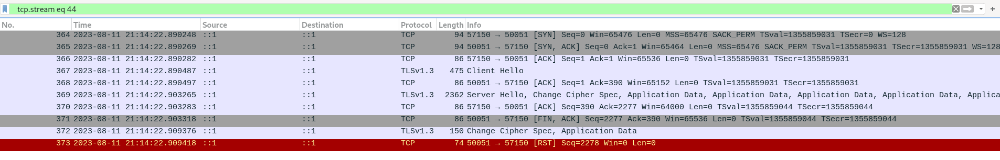
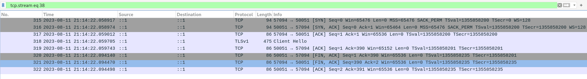

A small reproduction of Http2Session being not marked destroyed after a SIGPIPE.

For a larger example, see https://github.com/wwilfinger/grpc-pubsub-fake-public

Several things seem to be required to reproduce:

* TLS handshake is partially complete. Client has ACK'd ServerHello but has not sent a TLS response yet.
* The server-side will reject any futher communication because of a timeout configured on the server.
* stream configured for :method=POST (at least, :method=GET won't reproduce)
* stream.write(msg, () => stream.end()). The write causes SIGPIPE.

After stream.write(msg,() => stream.end()), the session is not marked as destroyed. Additional calls to session.request() will return new streams because [this check](https://github.com/nodejs/node/blob/v18.16.1/lib/internal/http2/core.js#L1734-L1735) on session.destroy is not hit. These new streams will pile up on the session. After enough session.requests() are made, the process OOMs.

# Background

In the wild we've seen NodeJS gRPC clients get "stuck" and continually report DEADLINE_EXCEEDED errors until the process is restarted. Much investigation later, this appears to be related to a sequence of:

* NodeJS client begins to create a TLS session. The handshake gets to the client receiving `ServerHello`.
* Something (other event loop work, starved cpu) prevents NodeJS from completing the TLS handshake
* Server-side times out the TLS connection after 10s and sends `FIN,ACK`
* NodeJS frees up, continues TLS handshake by sending `ChangeCipherSpec`
* Server-side sends `RST`

This code reproduces by using a HTTP2 server with an extremely short 1 millisecond read timeout. Not every connection attempt results in a 'connect', but eventually the timing works out. This appears to be [intentional](https://github.com/nodejs/node/blob/v18.16.1/lib/internal/http2/core.js#L1012-L1019) behavior.

# Running

We're using self-signed certificates. Run `./cert/generate.sh` which generates certs with the openssl cli. The certificates will be written to `./cert/`. The `compose.yml` is configured to read these certificates. I'm running on Linux (Fedora 38) fwiw.

`docker compose up --build` should build the container images and start them up. Most of the console output will be from the `client` container.

This is pretty consistent, but you may have to quit and restart to get TLS handshake timing to work out and the 'connect' event to emit.

The server is implemented in Golang to avoid using NodeJS on both ends.

# Packet Capture Screenshots

Every sequence which emits a 'connect' looks like this. Port 50051 is the server.

<details>
<summary>results in a 'connect' event</summary>



</details>

This sequence results in an 'error' event where error is "Client network socket disconnected before secure TLS connection was established". Again, port 50051 is the server

<details>
<summary>results in an 'error' event</summary>



</details>

# Logs

Example logs with `NODE_DEBUG=http2,tls,net strace -e 'trace=!all' node ./index.js`.

You can see nextStreamID and outboundQueueSize increasing with every request.


<details>
<summary>log</summary>

```
HTTP2 947910: Http2Session client: created
TLS 947910: client initRead handle? true buffered? false
NET 947910: _read
NET 947910: _read wait for connection
NET 947910: afterConnect
TLS 947910: client _start handle? true connecting? false requestOCSP? false
NET 947910: _read
NET 947910: Socket._handle.readStart
TLS 947910: client onhandshakedone
TLS 947910: client _finishInit handle? true alpn h2 servername example.cloudapis.test
TLS 947910: client emit secureConnect. authorized: true
HTTP2 947910: Http2Session client: setting up session handle
HTTP2 947910: Http2Session client: sending settings
HTTP2 947910: Http2Session client: submitting settings
session connect
HTTP2 947910: Http2Session client: initiating request
HTTP2 947910: Http2Session client: connected, initializing request
request() session state: {"effectiveLocalWindowSize":65535,"effectiveRecvDataLength":0,"nextStreamID":3,"localWindowSize":65535,"lastProcStreamID":0,"remoteWindowSize":65535,"outboundQueueSize":2,"deflateDynamicTableSize":0,"inflateDynamicTableSize":0}
stream.write()
--- SIGPIPE {si_signo=SIGPIPE, si_code=SI_USER, si_pid=947910, si_uid=1000} ---
stream write callback error: undefined
stream write callback: calling stream.end()
HTTP2 947910: Http2Stream 1 [Http2Session client]: shutting down writable on _final
stream timeout
request() error stream timeout
HTTP2 947910: Http2Session client: initiating request
HTTP2 947910: Http2Session client: connected, initializing request
request() session state: {"effectiveLocalWindowSize":65535,"effectiveRecvDataLength":0,"nextStreamID":5,"localWindowSize":65535,"lastProcStreamID":0,"remoteWindowSize":65518,"outboundQueueSize":1,"deflateDynamicTableSize":70,"inflateDynamicTableSize":0}
stream.write()
stream timeout
request() error stream timeout
HTTP2 947910: Http2Session client: initiating request
HTTP2 947910: Http2Session client: connected, initializing request
request() session state: {"effectiveLocalWindowSize":65535,"effectiveRecvDataLength":0,"nextStreamID":7,"localWindowSize":65535,"lastProcStreamID":0,"remoteWindowSize":65518,"outboundQueueSize":2,"deflateDynamicTableSize":70,"inflateDynamicTableSize":0}
stream.write()
stream timeout
request() error stream timeout
```
</details>
